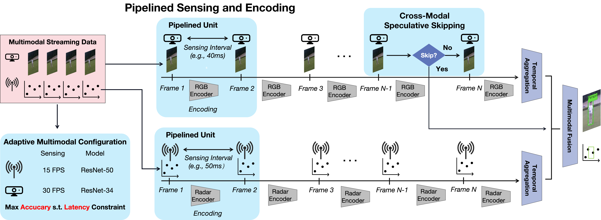

# MMEdge: Accelerating On-device Multimodal Inference via Pipelined Sensing and Encoding
A real-time end-to-end multimodal sensing and inference system.
This repository provides the public release of [**MMEdge**](https://arxiv.org/abs/2510.25327v4), a real-time on-device multimodal inference framework based on pipelined sensing and encoding.
Unlike traditional multimodal systems that wait for complete sensor inputs before inference, MMEdge decomposes data collection and computation into fine-grained sensing and encoding units, enabling fully pipelined and parallel execution across modalities.
To maintain accuracy under this fine-grained design, MMEdge introduces a lightweight temporal aggregation module that preserves temporal continuity across units.
It further incorporates an adaptive multimodal configuration optimizer that dynamically selects optimal sensing and model configurations under latency constraints, and a cross-modal speculative skipping mechanism that bypasses redundant computations when early predictions reach high confidence.
MMEdge achieves up to 75.8% reduction in end-to-end latency while maintaining comparable accuracy on multiple public datasets (LRW, NuScenes-QA) and a real-world UAV multimodal testbed, demonstrating its effectiveness for low-latency on-device multimodal perception and reasoning.

✅ Paper: [https://arxiv.org/abs/2510.25327v4](https://arxiv.org/abs/2510.25327v4) \
✅ Demo Video: [https://www.youtube.com/watch?v=n36M9ho2z9o](https://www.youtube.com/watch?v=n36M9ho2z9o)

## System Overview
MMEdge introduces three core modules to accelerate on-device multimodal inference:

- **Pipelined Sensing and Encoding**:
Decomposes sensing and inference into fine-grained units (e.g., frames or chunks), allowing parallel data collection and feature encoding to reduce idle time.

- **Adaptive Multimodal Configuration**:
Dynamically selects the optimal sensing and model configurations under latency constraints using a lightweight accuracy predictor and pre-profiled latency table.

- **Cross-Modal Speculative Skipping**:
Enables early inference termination by leveraging faster modalities’ features, skipping redundant processing of slower modalities when confidence is sufficient.


## Quick Start
### Offline Stage
#### 1. Installation
```shell
cd Offline
pip install requirements.txt
```

#### 2. Dataset preparation
- We take the audio-visual speech recognition task as an example in this repository. Please download the Lip Reading in the Wild (LRW) dataset [here](https://www.robots.ox.ac.uk/~vgg/data/lip_reading/lrw1.html).
- Move the dataset to `./Offline/data` and `./Online/data`.

#### 3. Train multimodal models
1. Train video models
    ```shell
    bash scripts/train_video.sh
    ```
2. Train audio models
    ```shell
    bash scripts/train_audio.sh
    ```
3. Train fusion models
    ```shell
    bash scripts/train_fusion.sh
    ```
#### 4. Train accuracy predictor

1. Generate accuracy table
   ```shell
   cd Offline
   python make_accuracy_table.py
   ```
2. Train accuracy predictor
   ```shell
   python train_accuracy_predictor.py
   ```
#### 4. Train cross-modal speculative skipping model
```shell
python train_gating.py
```

### Online Stage
#### 1. Installation
```shell
cd Online
pip install requirements.txt
```
Download checkpoints and dataset to the device, saved at `./Online/checkpoints` and `./Online/data` respectively.

#### 2. Run the data collection module to simulate real-time streaming sensor data during inference.
```shell
python data_collection_simulation.py
```

#### 3. Run end-to-end inference
```shell
python main.py
```

## Citation
Please consider to cite our paper if you use the code or data in your research project.

```bibtex
@article{huang2025mmedge,
  title={MMEdge: Accelerating On-device Multimodal Inference via Pipelined Sensing and Encoding},
  author={Huang, Runxi and Yu, Mingxuan and Tsoi, Mingyu and Ouyang, Xiaomin},
  journal={arXiv preprint arXiv:2510.25327},
  year={2025}
}
```
